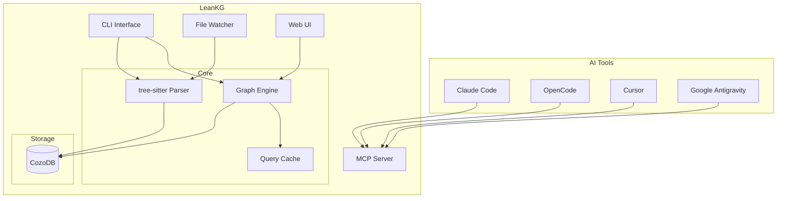

<p align="center">
  
</p>

# LeanKG

[](https://opensource.org/licenses/MIT)
[](https://www.rust-lang.org/)
[](README.md#requirements)

**Lightweight Knowledge Graph for AI-Assisted Development**

LeanKG is a local-first knowledge graph that gives AI coding tools accurate codebase context. It indexes your code, builds dependency graphs, generates documentation, and exposes an MCP server so tools like Cursor, OpenCode, and Claude Code can query the knowledge graph directly. No cloud services, no external databases—everything runs on your machine with minimal resources.

---

## Why LeanKG?

AI coding tools waste tokens scanning entire codebases. LeanKG provides **targeted context** instead:

| Scenario | Without LeanKG | With LeanKG |
|----------|----------------|-------------|
| **File review** | Full content of changed files + diff | Blast radius + structural summary |
| **Impact analysis** | Manually trace dependencies | `get_impact_radius` returns affected files |
| **Token count** | 9,600+ tokens for full scan | 13-42 tokens with graph |

**LeanKG achieves 98-99% token reduction** (~100x) as measured on real benchmarks.

---

## Architecture



---

## Features

### Core Features

| Feature | Status | Description |
|---------|--------|-------------|
| **Code Indexing** | Done | Parse and index Go, TypeScript, Python, and Rust codebases with tree-sitter |
| **Dependency Graph** | Done | Build call graphs with `IMPORTS`, `CALLS`, and `TESTED_BY` edges |
| **Impact Radius** | Done | Compute blast radius for any file to see downstream impact |
| **Auto Documentation** | Done | Generate markdown docs from code structure automatically |
| **MCP Server** | Done | Expose the graph via MCP protocol for AI tool integration |
| **File Watching** | Done | Watch for changes and incrementally update the index |
| **CLI** | Done | Single binary with init, index, serve, impact, and status commands |

### Business Logic Mapping

| Feature | Status | Description |
|---------|--------|-------------|
| **Annotations** | Done | Annotate code elements with business logic descriptions |
| **Link to Features** | Done | Link code elements to features |
| **Traceability** | Done | Show feature-to-code traceability |
| **Find by Domain** | Done | Find code elements by business domain |

### CLI Commands

| Command | Status | Description |
|---------|--------|-------------|
| `leankg init` | Done | Initialize LeanKG in the current directory |
| `leankg index [path]` | Done | Index source files at the given path |
| `leankg index --incremental` | Done | Only index changed files (git-based) |
| `leankg index --lang go,ts,py,rs` | Done | Filter by language |
| `leankg index --exclude vendor,node_modules` | Done | Exclude patterns |
| `leankg serve` | Done | Start the MCP server (WebSocket) |
| `leankg serve --mcp-port 3000` | Done | Custom MCP server port |
| `leankg mcp-stdio` | Done | Start MCP server with stdio transport |
| `leankg impact <file> --depth N` | Done | Compute blast radius for a file |
| `leankg status` | Done | Show index statistics and status |
| `leankg generate` | Done | Generate documentation from the graph |
| `leankg install` | Done | Auto-install MCP config for AI tools |
| `leankg watch` | Done | Start file watcher for auto-indexing |
| `leankg quality --min-lines N` | Done | Find oversized functions by line count |
| `leankg query <text> --kind name` | Done | Query the knowledge graph |
| `leankg annotate <element> -d <desc>` | Done | Add business logic annotation |
| `leankg link <element> <id>` | Done | Link element to feature |
| `leankg search-annotations <query>` | Done | Search business logic annotations |
| `leankg show-annotations <element>` | Done | Show annotations for a specific element |
| `leankg trace --feature <id>` | Done | Show feature-to-code traceability |
| `leankg find-by-domain <domain>` | Done | Find code by business domain |
| `leankg export` | Done | Export graph data as JSON |

### MCP Tools

| Tool | Status | Description |
|------|--------|-------------|
| `query_file` | Done | Find file by name or pattern |
| `get_dependencies` | Done | Get file dependencies (direct imports) |
| `get_dependents` | Done | Get files depending on target |
| `get_impact_radius` | Done | Get all files affected by change within N hops |
| `get_review_context` | Done | Generate focused subgraph + structured review prompt |
| `get_context` | Done | Get AI context for file (minimal, token-optimized) |
| `find_function` | Done | Locate function definition |
| `get_call_graph` | Done | Get function call chain (full depth) |
| `search_code` | Done | Search code elements by name/type |
| `generate_doc` | Done | Generate documentation for file |
| `find_large_functions` | Done | Find oversized functions by line count |
| `get_tested_by` | Done | Get test coverage for a function/file |

---

## How LeanKG Saves Tokens

### Token Optimization Strategies

1. **Blast Radius Analysis** - Instead of scanning the entire codebase, LeanKG computes the exact scope of impact. When you change a file, `get_impact_radius` tells you exactly which files are affected within N hops.

2. **Structural Context** - Instead of full file contents, LeanKG provides structural summaries:
   - Function signatures
   - Import relationships
   - Call graph paths
   - TESTED_BY coverage

3. **Targeted Queries** - AI tools can ask specific questions:
   - "What depends on this file?"
   - "Which tests cover this function?"
   - "What's the call chain for this function?"

### Supported AI Tools

| Tool | Integration | Status |
|------|-------------|--------|
| **Claude Code** | MCP | Supported via `leankg install` |
| **OpenCode** | MCP | Supported via `leankg install` |
| **Cursor** | MCP | Supported via `leankg install` |
| **Google Antigravity** | MCP | Supported via `leankg install` |
| **Windsurf** | MCP | Supported (MCP compatible) |
| **Codex** | MCP | Supported (MCP compatible) |

### Integration Setup

```bash
# 1. Initialize and index your project
leankg init
leankg index ./src

# 2. Install MCP config for your AI tool
leankg install

# 3. Start the MCP server
leankg serve

# 4. In your AI tool, query LeanKG:
# - "What's the impact radius of src/auth/login.rs?"
# - "Show me the call graph for validate_user"
# - "Find all tests for handle_request"
```

### Token Savings Example (Benchmarked)

Real benchmark results from the [Go API Service example](examples/go-api-service/):

| Scenario | Without LeanKG | With LeanKG | Savings |
|----------|----------------|-------------|---------|
| Impact Analysis | 835 tokens | 13 tokens | **98.4%** |
| Full Feature Testing | 9,601 tokens | 42 tokens | **99.6%** |

```bash
# Run the benchmark yourself
cd examples/go-api-service
python3 benchmark.py
```

**Before LeanKG**: AI must scan entire codebase to understand dependencies (~9,600 tokens)

**After LeanKG**: LeanKG provides targeted subgraph with relationships pre-computed (~42 tokens)

---

## Requirements

- **Rust** 1.70+ (for building from source)
- **Platforms**: macOS, Linux

---

## Installation

### From Source

```bash
git clone https://github.com/YOUR_ORG/LeanKG.git
cd LeanKG
cargo build --release
```

The binary will be at `./target/release/leankg`. Add it to your PATH or use `cargo install --path .` for a global install.

### Cargo Install (when published)

```bash
cargo install leankg
```

---

## Quick Start

```bash
# 1. Initialize LeanKG in your project
leankg init

# 2. Index your codebase
leankg index ./src

# 3. Start the MCP server (for AI tools)
leankg serve

# 4. Optional: compute impact radius for a file
leankg impact src/main.rs --depth 3

# 5. Optional: generate documentation
leankg generate

# 6. Check index status
leankg status

# 7. Install MCP config for AI tools
leankg install
```

---

## CLI Reference

| Command | Description |
|---------|-------------|
| `leankg init` | Initialize LeanKG in the current directory |
| `leankg index [path]` | Index source files at the given path |
| `leankg serve` | Start the MCP server (WebSocket) |
| `leankg mcp-stdio` | Start MCP server with stdio transport |
| `leankg impact <file> [--depth N]` | Compute blast radius for a file |
| `leankg status` | Show index statistics and status |
| `leankg generate` | Generate documentation from the graph |
| `leankg install` | Auto-install MCP config for AI tools |
| `leankg watch` | Start file watcher for auto-indexing |
| `leankg quality` | Find oversized functions |
| `leankg query <text>` | Query the knowledge graph |
| `leankg annotate <element>` | Add business logic annotation |
| `leankg link <element> <id>` | Link element to feature |
| `leankg search-annotations` | Search business logic annotations |
| `leankg show-annotations <element>` | Show annotations for element |
| `leankg trace` | Show feature-to-code traceability |
| `leankg find-by-domain` | Find code by business domain |
| `leankg export` | Export graph data as JSON |

---

## Tech Stack

| Component | Technology |
|-----------|------------|
| Language | Rust |
| Database | CozoDB (embedded relational-graph, Datalog queries) |
| Parsing | tree-sitter |
| CLI | Clap |
| Web Server | Axum |

> **Note**: Transitioned storage engine from SurrealDB to embedded CozoDB to strictly minimize RAM usage and utilize Datalog for highly efficient graph traversals.

---

## Project Structure

```
src/
  cli/       - CLI commands (Clap)
  config/    - Project configuration
  db/        - CozoDB persistence layer
  doc/       - Documentation generator
  graph/     - Graph query engine
  indexer/   - Code parser (tree-sitter)
  mcp/       - MCP protocol handler
  watcher/   - File change watcher
  web/       - Web server (Axum)
```

---

## License

MIT