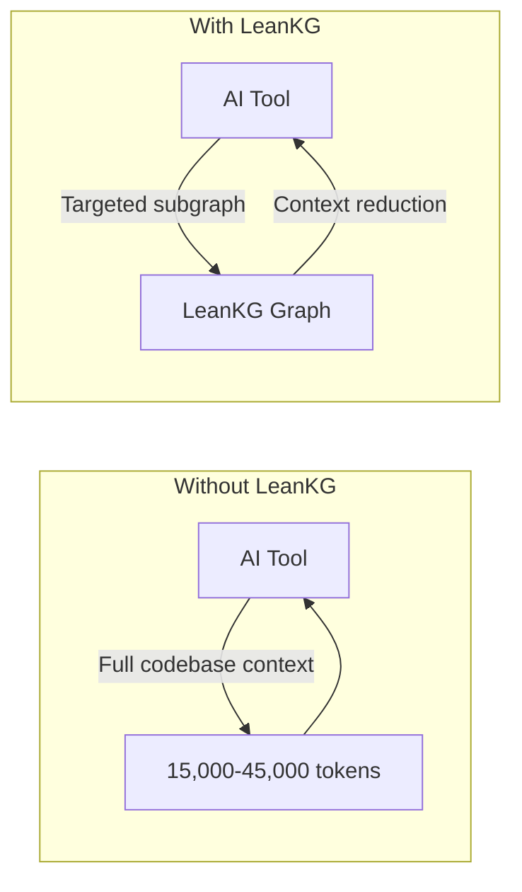

<p align="center">
  
</p>

# LeanKG

[](https://opensource.org/licenses/MIT)
[](https://www.rust-lang.org/)
[](https://crates.io/crates/leankg)
[](https://safeskill.dev/scan/freepeak-leankg)

**Lightweight Knowledge Graph for AI-Assisted Development**

LeanKG is a local-first knowledge graph that gives AI coding tools accurate codebase context. It indexes your code, builds dependency graphs, and exposes an MCP server so tools like Cursor, OpenCode, and Claude Code can query the knowledge graph directly. No cloud services, no external databases.


Visualize your knowledge graph with force-directed layout, WebGL rendering, and community clustering.


See [docs/web-ui.md](docs/web-ui.md) for more features.

---

## Live Demo

Try LeanKG without installing: **https://leankg.onrender.com**

```bash
leankg web --port 9000
```

---

## Installation

### One-Line Install (Recommended)

```bash
curl -fsSL https://raw.githubusercontent.com/FreePeak/LeanKG/main/scripts/install.sh | bash -s -- <target>
```

**Supported targets:**

| Target | AI Tool | Auto-Installed |
|--------|---------|-----------------|
| `opencode` | OpenCode AI | Binary + MCP + Plugin + Skill + AGENTS.md |
| `cursor` | Cursor AI | Binary + MCP + Skill + AGENTS.md + Session Hook |
| `claude` | Claude Code | Binary + MCP + Plugin + Skill + CLAUDE.md + Session Hook |
| `gemini` | Gemini CLI | Binary + MCP + Skill + GEMINI.md |
| `kilo` | Kilo Code | Binary + MCP + Skill + AGENTS.md |
| `antigravity` | Google Antigravity | Binary + MCP + Skill + GEMINI.md |

**Examples:**
```bash
curl -fsSL https://raw.githubusercontent.com/FreePeak/LeanKG/main/scripts/install.sh | bash -s -- cursor
curl -fsSL https://raw.githubusercontent.com/FreePeak/LeanKG/main/scripts/install.sh | bash -s -- claude
```

### Install via Cargo or Build from Source

```bash
cargo install leankg && leankg --version
```

```bash
git clone https://github.com/FreePeak/LeanKG.git && cd LeanKG && cargo build --release
```

---

## Quick Start

```bash
leankg init                              # Initialize LeanKG in your project
leankg index ./src                        # Index your codebase
leankg watch ./src                        # Auto-index on file changes
leankg impact src/main.rs --depth 3       # Calculate blast radius
leankg status                             # Check index status
leankg metrics                            # View token savings
leankg web                                # Start Web UI at http://localhost:8080
leankg export --format mermaid            # Export graph as Mermaid, DOT, or JSON
leankg quality --min-lines 50             # Find oversized functions
leankg detect-clusters                    # Identify functional code communities
leankg trace --all                        # Show feature-to-code traceability
leankg annotate src/main.rs::main -d "Entry point"  # Annotate code elements

# Run shell commands with RTK compression
leankg run -- cargo test -- --compress

# REST API server with auth
leankg api-serve --port 8081 --auth
leankg api-key create --name my-key

# Process management
leankg proc status                        # Show running LeanKG/Vite processes
leankg proc kill                          # Kill all LeanKG/Vite processes

# Obsidian vault sync
leankg obsidian init                      # Initialize Obsidian vault structure
leankg obsidian push                      # Push LeanKG data to Obsidian notes
leankg obsidian pull                      # Pull annotation edits from Obsidian
leankg obsidian watch                     # Watch vault for changes and auto-pull
leankg obsidian status                    # Show vault status

# Microservice call graph (via Web UI)
leankg web                                # Start Web UI at http://localhost:8080
                                          # Then visit http://localhost:8080/services

# Multi-repo registry
leankg register my-project                # Register a repository
leankg list                               # List all registered repos
leankg setup                              # Configure MCP for all repos + install Claude hooks
```

See [docs/cli-reference.md](docs/cli-reference.md) for all commands.

---

## Claude Code Setup

LeanKG auto-triggers in Claude Code sessions via lifecycle hooks that route search intents to LeanKG tools instead of native tools.

```bash
# Install LeanKG with Claude Code hooks and plugin
leankg setup

# Then restart Claude Code or run:
/reload-plugins
```

**What `leankg setup` installs:**
- `.claude-plugin/` - Plugin manifest for Claude Code validation
- `hooks/` - Full lifecycle hooks: Setup, SessionStart, UserPromptSubmit, PreToolUse, PostToolUse, Stop
- Adds `leankg@local` to `enabledPlugins` in `~/.claude/settings.json`

**Hook lifecycle:**
- `Setup` - Version gating on startup
- `SessionStart` - Injects tool selection hierarchy into every session
- `UserPromptSubmit` - Initializes session context with LeanKG patterns
- `PreToolUse` - Nudges toward LeanKG when you use Grep/Read/Bash for code analysis
- `PostToolUse` - Logs LeanKG MCP tool usage for analytics
- `Stop` - Captures session summary for future context retrieval

---

## How LeanKG Helps



**Without LeanKG**: AI processes full context from files found via grep/search.
**With LeanKG**: AI queries knowledge graph for targeted context. Token reduction varies by task complexity (see [benchmark results](tests/benchmark/results/clean-benchmark-2026-04-21.md)).

---


## Highlights

- **Auto-Init** -- Install script configures MCP, rules, skills, and hooks automatically
- **Auto-Trigger** -- Session hooks inject LeanKG context into every AI tool session
- **Token Optimized** -- Targeted subgraph retrieval vs full file scanning
- **Impact Radius** -- Compute blast radius before making changes
- **Pre-Commit Risk Analysis** -- `detect_changes` classifies risk as critical/high/medium/low
- **Dependency Graph** -- Build call graphs with `IMPORTS`, `CALLS`, `TESTED_BY` edges
- **MCP Server** -- Expose graph via MCP protocol for AI tool integration (40 tools)
- **Orchestration** -- Smart context routing with caching via natural language intent
- **Community Detection** -- Auto-detect functional clusters in your codebase
- **Multi-Language** -- Index Go, TypeScript, Python, Rust, Java, Kotlin, Ruby, PHP, Perl, R, Elixir, Bash with tree-sitter
- **Android** -- Extract XML layouts, resources, manifest relationships, and navigation graphs
- **Service Topology** -- Microservice call graph visualization
- **Annotation Search** -- Search code by `@Entity`, `@HiltViewModel`, and other annotations
- **Graph Export** -- Export as JSON, DOT, or Mermaid formats
- **REST API** -- Full REST API with auth and API key management
- **RTK Compression** -- Run shell commands with token-saving compression

See [docs/architecture.md](docs/architecture.md) for system design and data model details.

---

## Supported AI Tools

| Tool | Auto-Setup | Session Hook | Plugin | Full Lifecycle Hooks |
|------|------------|--------------|--------|---------------------|
| Cursor | Yes | session-start | - | - |
| Claude Code | Yes | session-start | Yes | Setup, SessionStart, UserPromptSubmit, PreToolUse, PostToolUse, Stop |
| OpenCode | Yes | - | Yes | - |
| Kilo Code | Yes | - | - | - |
| Gemini CLI | Yes | - | - | - |
| Google Antigravity | Yes | - | - | - |
| Codex | Yes | - | - | - |

> **Note:** Cursor requires per-project installation. The AI features work on a per-workspace basis, so LeanKG should be installed in each project directory where you want AI context injection.

See [docs/agentic-instructions.md](docs/agentic-instructions.md) for detailed setup and auto-trigger behavior.

---

## Context Metrics

Track token savings to understand LeanKG's efficiency.

```bash
leankg metrics --json              # View with JSON output
leankg metrics --since 7d           # Filter by time
leankg metrics --tool search_code   # Filter by tool
```

See [docs/metrics.md](docs/metrics.md) for schema and examples.

---

## Update

```bash
# Check current version
leankg version

# Update LeanKG binary (kills processes, removes old binary, installs hooks)
leankg update

# Or via install script
curl -fsSL https://raw.githubusercontent.com/FreePeak/LeanKG/main/scripts/install.sh | bash -s -- update

# Obsidian vault sync
leankg obsidian init                      # Initialize Obsidian vault
leankg obsidian push                      # Push LeanKG data to Obsidian notes
leankg obsidian pull                      # Pull annotation edits from Obsidian
```


---

## Documentation

| Doc | Description |
|-----|-------------|
| [docs/cli-reference.md](docs/cli-reference.md) | All CLI commands |
| [docs/mcp-tools.md](docs/mcp-tools.md) | MCP tools reference |
| [docs/agentic-instructions.md](docs/agentic-instructions.md) | AI tool setup & auto-trigger |
| [docs/architecture.md](docs/architecture.md) | System design, data model |
| [docs/web-ui.md](docs/web-ui.md) | Web UI features |
| [docs/metrics.md](docs/metrics.md) | Metrics schema & examples |
| [docs/benchmark.md](docs/benchmark.md) | Performance benchmarks |
| [docs/roadmap.md](docs/roadmap.md) | Feature planning |
| [docs/tech-stack.md](docs/tech-stack.md) | Tech stack & structure |
| [docs/android-extraction.md](docs/android-extraction.md) | Android XML & resource extraction |

---

## Troubleshooting

### Database Lock Error

If you see `database is locked (code 5)`, another LeanKG process is holding the database:

```bash
# Kill all leankg and vite processes
leankg-kill

# Or manually
pkill -9 -f "leankg"
pkill -9 -f "vite"
```

### Process Management

```bash
leankg proc kill        # Kill all leankg and vite processes
leankg proc status      # Show running leankg/vite processes
```

**Important:** Always kill the web server before indexing to avoid database lock conflicts.

---

## Performance Benchmarks

### Load Test Results (100K nodes)

| Operation | Throughput |
|-----------|------------|
| Insert elements | ~57,618 elements/sec |
| Insert relationships | ~67,067 relationships/sec |
| Retrieve all elements | ~418,718 elements/sec |
| Cache speedup (cold to warm) | 345-461x |

Run load tests:
```bash
cargo test --release load_test -- --nocapture
```

### A/B Benchmark Results

See [tests/benchmark/results/clean-benchmark-2026-04-21.md](tests/benchmark/results/clean-benchmark-2026-04-21.md) for detailed A/B testing results comparing LeanKG vs baseline code search.

---

## Requirements

- Rust 1.75+
- macOS or Linux

---

## License

MIT

---

## Star History

<a href="https://www.star-history.com/?repos=FreePeak%2FLeanKG&type=date&legend=top-left">
 <picture>
   <source media="(prefers-color-scheme: dark)" srcset="https://api.star-history.com/chart?repos=FreePeak/LeanKG&type=date&theme=dark&legend=top-left" />
   <source media="(prefers-color-scheme: light)" srcset="https://api.star-history.com/chart?repos=FreePeak/LeanKG&type=date&legend=top-left" />
   
 </picture>
</a>
