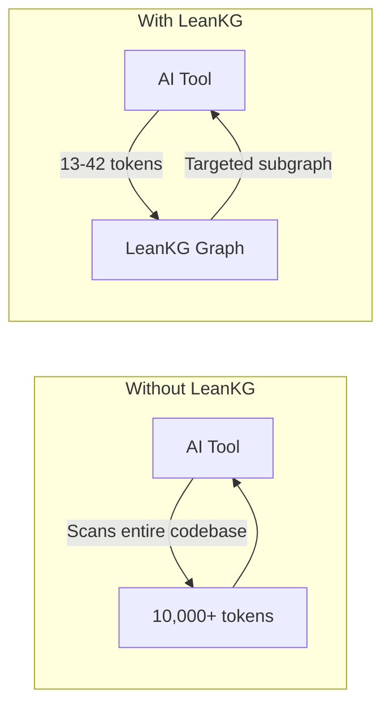
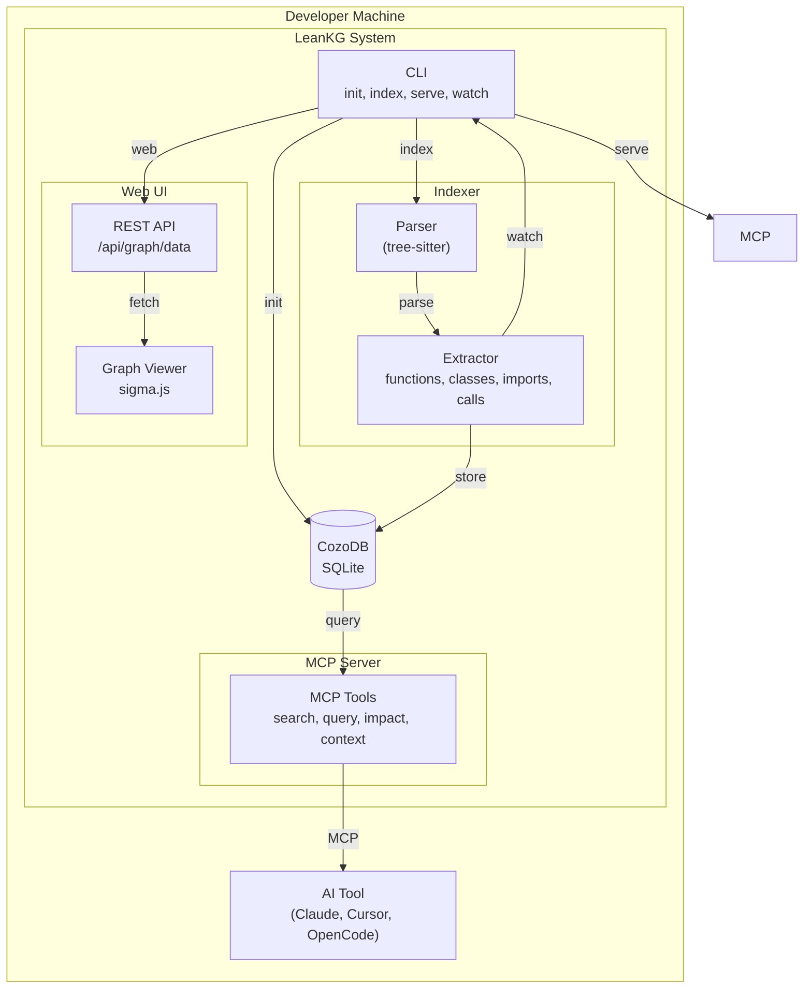
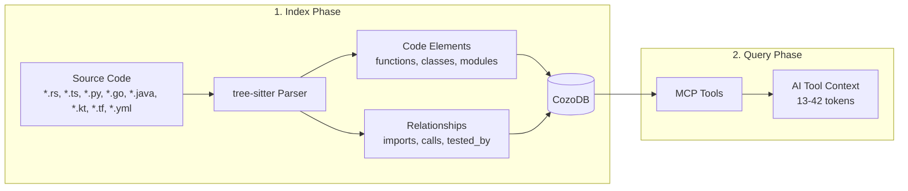

<p align="center">
  
</p>

# LeanKG

[](https://opensource.org/licenses/MIT)
[](https://www.rust-lang.org/)
[](https://crates.io/crates/leankg)

**Lightweight Knowledge Graph for AI-Assisted Development**

LeanKG is a local-first knowledge graph that gives AI coding tools accurate codebase context. It indexes your code, builds dependency graphs, generates documentation, and exposes an MCP server so tools like Cursor, OpenCode, and Claude Code can query the knowledge graph directly. No cloud services, no external databases -- everything runs on your machine with minimal resources.

---

## How LeanKG Helps



**Without LeanKG**: AI scans entire codebase, wasting tokens on irrelevant context (~10,000+ tokens).

**With LeanKG**: AI queries the knowledge graph for targeted context only (13-42 tokens). **98% token saving** for impact analysis.

---

## Installation

### One-Line Install (Recommended)

Install the LeanKG binary, configure MCP, and add agent instructions for your AI coding tool:

```bash
curl -fsSL https://raw.githubusercontent.com/FreePeak/LeanKG/main/scripts/install.sh | bash -s -- <target>
```

This installs:
1. LeanKG binary to `~/.local/bin`
2. MCP configuration for your AI tool
3. Agent instructions (LeanKG tool usage guidance) to the tool's config directory

**Supported targets:**

| Target | AI Tool | Global Install | Agent Instructions |
|--------|---------|--------------|-------------------|
| `opencode` | OpenCode AI | `~/.config/opencode/opencode.json` | `~/.config/opencode/AGENTS.md` |
| `cursor` | Cursor AI | `~/.cursor/mcp.json` (global) | `~/.cursor/AGENTS.md` |
| `claude` | Claude Code/Desktop | `~/.config/claude/settings.json` | `~/.config/claude/CLAUDE.md` |
| `gemini` | Gemini CLI / Google Antigravity | `~/.config/gemini-cli/mcp.json` | `~/.gemini/GEMINI.md` |
| `kilo` | Kilo Code | `~/.config/kilo/kilo.json` | `~/.config/kilo/AGENTS.md` |

**Examples:**

```bash
# Install for OpenCode
curl -fsSL https://raw.githubusercontent.com/FreePeak/LeanKG/main/scripts/install.sh | bash -s -- opencode

# Install for Cursor (binary only - see per-project setup below)
curl -fsSL https://raw.githubusercontent.com/FreePeak/LeanKG/main/scripts/install.sh | bash -s -- cursor

# Install for Claude Code
curl -fsSL https://raw.githubusercontent.com/FreePeak/LeanKG/main/scripts/install.sh | bash -s -- claude

# Install for Gemini CLI
curl -fsSL https://raw.githubusercontent.com/FreePeak/LeanKG/main/scripts/install.sh | bash -s -- gemini

# Install for Kilo Code
curl -fsSL https://raw.githubusercontent.com/FreePeak/LeanKG/main/scripts/install.sh | bash -s -- kilo

# Install for Google Antigravity
curl -fsSL https://raw.githubusercontent.com/FreePeak/LeanKG/main/scripts/install.sh | bash -s -- antigravity
```

### Cursor Installation Details

LeanKG for Cursor includes:
- **Global MCP server** - `~/.cursor/mcp.json` adds LeanKG to all projects
- **Plugin** - `~/.cursor/plugins/leankg/` with:
  - `skills/using-leankg/SKILL.md` - Mandatory LeanKG-first skill
  - `rules/leankg-rule.mdc` - Auto-trigger rule for code search
  - `agents/leankg-agents.md` - Agent instructions
  - `commands/leankg-commands.md` - Command reference
  - `hooks/session-start` - Session bootstrap hook
- **User skill preservation** - Other skills in `~/.cursor/skills/` are NOT removed

### Per-Project MCP Setup (Cursor)

LeanKG uses **per-project MCP configuration** for Cursor. This allows LeanKG to automatically detect and index the project you're working on.

**In each project directory, run:**
```bash
leankg install    # Creates .cursor/mcp.json in the project
```

This creates `.cursor/mcp.json` which Cursor automatically detects when you open that project.

**Example workflow:**
```bash
# First time: install LeanKG binary globally
curl -fsSL https://raw.githubusercontent.com/FreePeak/LeanKG/main/scripts/install.sh | bash -s -- cursor

# Then in each project you want to use LeanKG with:
cd /path/to/project
leankg install    # Creates .cursor/mcp.json
# Restart Cursor or click refresh in MCP settings
```

### Install via Cargo

```bash
cargo install leankg
leankg --version
```

### Build from Source

```bash
git clone https://github.com/FreePeak/LeanKG.git
cd LeanKG
cargo build --release
```

---

## Try Without Install

**Use GitHub Codespaces** to try LeanKG in your browser - no installation required!

1. Go to **github.com/FreePeak/LeanKG**
2. Click **"Code" → "Create Codespace"**
3. LeanKG auto-installs when the codespace starts
4. In the terminal:
   ```bash
   leankg index ./src
   leankg web
   ```
5. Click **"Open in Browser"** on port 8080

**Free tier:** 60 hours/month (3 months), then 15 hours/month

---

## Live Demo

Try LeanKG without installing - visit the live demo at **https://leankg.onrender.com**

---

## Update

To update LeanKG to the latest version, run the same install command:

```bash
curl -fsSL https://raw.githubusercontent.com/FreePeak/LeanKG/main/scripts/install.sh | bash -s -- update
```

This will replace the existing binary with the latest release while preserving your configuration.

---

## Quick Start

```bash
# 1. Initialize LeanKG in your project
leankg init

# 2. Index your codebase
leankg index ./src

# 3. Start the MCP server (for AI tools)
leankg serve

# 4. Start the Web UI (for visualization)
# Open http://localhost:8080 in your browser
leankg web

# 5. Run commands with RTK-style compression
leankg run "cargo test"

# 6. Compute impact radius for a file
leankg impact src/main.rs --depth 3

# 7. Check index status
leankg status

# 8. Watch for changes and auto-index
leankg watch ./src

# 9. View context metrics (token savings)
leankg metrics
leankg metrics --seed  # Seed test data
```

---

## How It Works

### C4 Model - Level 2: Component Diagram



### Data Flow



### Node Types in the Graph

| Element Type | Description | Example |
|--------------|-------------|---------|
| `function` | Code functions | `src/auth.rs::validate_token` |
| `class` | Classes and structs | `src/db/models.rs::User` |
| `module` | Files/modules | `src/db/models.rs` |
| `document` | Documentation files | `docs/architecture.md` |
| `doc_section` | Doc headings | `docs/api.md::Usage` |

### Relationship Types

| Type | Direction | Description |
|------|----------|-------------|
| `calls` | A → B | Function A calls function B (confidence 0.5-1.0) |
| `imports` | A → B | Module A imports module B |
| `contains` | doc → section | Document contains section |
| `tested_by` | A → B | Code A is tested by test B |
| `tests` | test → B | Test file tests code B |
| `documented_by` | A → B | Code A is documented by doc B |
| `references` | doc → code | Doc references code element |
| `defines` | A → B | Element A defines element B |
| `implements` | struct → interface | Struct implements interface |

**Key Insight:** The graph stores the FULL dependency graph at indexing time. When you query, LeanKG traverses N hops from your target to find all affected elements - no file scanning needed.

---

## MCP Server Setup

See [MCP Setup](docs/mcp-setup.md) for detailed setup instructions for all supported AI tools.

---

## Agentic Instructions for AI Tools

LeanKG instructs AI coding agents to use LeanKG **first** for codebase queries.

### Quick Rule to Add Manually

Add this to your AI tool's instruction file:

```markdown
## MANDATORY: Use LeanKG First
Before ANY codebase search/navigation, use LeanKG tools:
1. `mcp_status` - check if ready
2. Use tool: `search_code`, `find_function`, `query_file`, `get_impact_radius`, `get_dependencies`, `get_dependents`, `get_tested_by`, `get_context`, `get_review_context`
3. Only fallback to grep/read if LeanKG fails

| Task | Use |
|------|-----|
| Where is X? | `search_code` or `find_function` |
| What breaks if I change Y? | `get_impact_radius` or `detect_changes` |
| What tests cover Y? | `get_tested_by` |
| How does X work? | `get_context`, `get_review_context` |
| Read file efficiently? | `ctx_read` (with adaptive/full/map/signatures modes) |
| Intelligent routing? | `orchestrate` (cache-graph-compress flow) |
```

### Instruction Files (Auto-installed)

| Tool | File | Auto-install |
|------|------|--------------|
| Claude Code | `~/.config/claude/CLAUDE.md` | Yes |
| OpenCode | `~/.config/opencode/AGENTS.md` | Yes |
| Cursor | `~/.cursor/AGENTS.md` | Yes |
| KiloCode | `~/.config/kilo/AGENTS.md` | Yes |
| Codex | `~/.config/codex/AGENTS.md` | Yes |
| Gemini CLI | `~/.gemini/GEMINI.md` | Yes |
| Google Antigravity | `~/.gemini/GEMINI.md` | Yes |

See [Agentic Instructions](docs/agentic-instructions.md) for detailed setup.

### OpenCode Plugin (Auto-Trigger)

LeanKG includes an OpenCode plugin that **automatically injects LeanKG context into every prompt**. Add to your `opencode.json`:

```json
{
  "plugins": ["leankg@git+https://github.com/FreePeak/LeanKG.git"]
}
```

This makes LeanKG tools **always available** without manual activation. See [`.opencode/INSTALL.md`](.opencode/INSTALL.md) for details.

### Claude Code Plugin (Auto-Trigger)

LeanKG is available via the official Claude plugin marketplace:

```
/plugin install leankg@claude-plugins-official
```

Or register the marketplace:

```
/plugin marketplace add FreePeak/leankg-marketplace
/plugin install leankg@leankg-marketplace
```

See [`.claude-plugin/INSTALL.md`](.claude-plugin/INSTALL.md) for details.

### Cursor Plugin (Auto-Trigger)

LeanKG is available via the Cursor plugin marketplace:

```
/add-plugin leankg
```

See [`.cursor-plugin/INSTALL.md`](.cursor-plugin/INSTALL.md) for details.

### Gemini CLI / Google Antigravity (Auto-Trigger)

Install via gemini extensions:

```
gemini extensions install https://github.com/FreePeak/LeanKG
```

See [`GEMINI.md`](GEMINI.md) for context file details.

### Codex (Fetch Instructions)

Tell Codex:

```
Fetch and follow instructions from https://raw.githubusercontent.com/FreePeak/LeanKG/refs/heads/main/.codex/INSTALL.md
```

See [`.codex/INSTALL.md`](.codex/INSTALL.md) for details.

### Kilo Code (Fetch Instructions)

Tell Kilo Code:

```
Fetch and follow instructions from https://raw.githubusercontent.com/FreePeak/LeanKG/refs/heads/main/.kilo/INSTALL.md
```

See [`.kilo/INSTALL.md`](.kilo/INSTALL.md) for details.

---

## Highlights

- **Token Concise** -- Returns 13-42 tokens per query vs 10,000+ tokens for full codebase scan. AI tools get exactly what they need.
- **Token Saving** -- Up to 98% token reduction for impact analysis queries. Index once, query efficiently forever.
- **Code Indexing** -- Parse and index Go, TypeScript, Python, Rust, Java, Kotlin, C++, C#, Ruby, and PHP codebases with tree-sitter.
- **Dependency Graph** -- Build call graphs with `IMPORTS`, `CALLS`, `TESTED_BY`, and `REFERENCES` edges.
- **Impact Radius** -- Compute blast radius for any file to see downstream impact with severity classification (WILL BREAK, LIKELY AFFECTED, MAY BE AFFECTED).
- **Cluster Detection** -- Community detection to identify code clusters and their relationships.
- **Business Logic Mapping** -- Annotate code elements with business logic, link to user stories and features, trace requirements to code.
- **Auto-Indexing** -- Watch mode automatically updates the index when files change.
- **Context Metrics** -- Track token savings, F1 scores, and usage statistics per tool call with full query metadata.
- **Auto Documentation** -- Generate markdown docs from code structure automatically.
- **MCP Server** -- Expose the graph via MCP protocol for AI tool integration (stdio transport).
- **File Watching** -- Watch for changes and incrementally update the index.
- **CLI** -- Single binary with 30+ commands for indexing, querying, annotating, benchmarking, and serving.
- **RTK Compression** -- RTK-style compression for CLI output and MCP responses (`leankg run`, compress_response on all graph tools).
- **Orchestrator** -- Intelligent query routing with cache-graph-compress flow and adaptive compression modes.
- **Traceability** -- Show feature-to-code and requirement-to-code traceability chains via `trace` command.
- **Documentation Mapping** -- Index docs/ directory, map doc references to code elements, generate `get_doc_for_file` chains.
- **Graph Viewer** -- Visualize knowledge graph using standalone web UI with sigma.js.
- **REST API** -- Start a REST API server with authentication (`leankg api-serve --port 8080 --auth`).
- **Global Registry** -- Manage multiple repositories from a single global registry (`leankg register`, `leankg list`).
- **Benchmark** -- Compare LeanKG context quality against OpenCode, Gemini, and Kilo CLI tools.
- **Compression Modes** -- File reading with adaptive modes: `adaptive`, `full`, `map`, `signatures`, `diff`, `aggressive`, `entropy`, `lines`.
- **Change Detection** -- Pre-commit risk analysis with severity levels (critical/high/medium/low) via `detect_changes` tool.
- **Multi-Language** -- Also supports Terraform (`.tf`), CI/CD YAML (GitHub workflows, GitLab CI, Azure Pipelines), and Markdown docs.
- **Test Detection** -- Auto-detects test files across all languages and creates `tested_by` relationships.

---

## Benchmark Results

### Core Value Props: Token Concise + Token Saving

| Metric | Value |
|--------|-------|
| **Tokens per query** | 13-42 tokens (vs 10,000+ without) |
| **Token saving** | Up to 98% for impact analysis |
| **Context correctness** | F1 0.31-0.46 on complex queries |

LeanKG provides **concise context** (targeted subgraph, not full scan) and **saves tokens** over baseline.

| Metric | Baseline | LeanKG |
|--------|----------|--------|
| Tokens (7-test avg) | 150,420 | 191,468 |
| Token overhead | - | +41,048 |
| F1 wins | 0 | 2/7 tests |
| Context correctness | - | Higher |

**Key Findings:**
- LeanKG wins on F1 context quality in 2/7 tests (navigation, impact analysis)
- Token overhead: +41,048 tokens across all tests (pending deduplication fix)
- Context deduplication optimizations pending (see [AB Testing Results](docs/analysis/ab-testing-results-2026-04-08.md))

**Historical (2026-03-25):** 98.4% token savings for impact analysis on Go example

See [AB Testing Results](docs/analysis/ab-testing-results-2026-04-08.md) for detailed analysis and [benchmark/README.md](benchmark/README.md) for test methodology.

---

## Web UI

Start the web UI with `leankg web` or `leankg serve` and open [http://localhost:8080](http://localhost:8080).

### Graph Viewer


The graph viewer provides an interactive visualization of your codebase's dependency graph. Filter by element type, zoom, pan, and click nodes for details.

See [Web UI](docs/web-ui.md) for detailed documentation.

---

## Auto-Indexing

LeanKG watches your codebase and automatically keeps the knowledge graph up-to-date. When you modify, create, or delete files, LeanKG incrementally updates the index.

```bash
# Watch mode - auto-index on file changes
leankg watch ./src

# Or use the serve command with auto-index enabled
leankg serve --watch ./src
```

See [CLI Reference](docs/cli-reference.md#auto-indexing) for detailed commands.

---

## Context Metrics

Track token savings and usage statistics to understand how LeanKG improves your AI tool's context efficiency.

```bash
# View metrics summary
leankg metrics

# View with JSON output
leankg metrics --json

# Filter by time period
leankg metrics --since 7d

# Filter by tool name
leankg metrics --tool search_code

# Seed test data for demo
leankg metrics --seed

# Reset all metrics
leankg metrics --reset

# Cleanup old metrics (retention: 30 days default)
leankg metrics --cleanup --retention 60
```

### Metrics Schema

| Field | Index | Type | Description |
|-------|-------|------|-------------|
| `tool_name` | 0 | String | LeanKG tool name (search_code, get_context, etc.) |
| `timestamp` | 1 | Int | Unix timestamp of the call |
| `project_path` | 2 | String | Project root being queried |
| `input_tokens` | 3 | Int | Tokens in the query |
| `output_tokens` | 4 | Int | Tokens returned |
| `output_elements` | 5 | Int | Number of elements returned |
| `execution_time_ms` | 6 | Int | Tool execution time |
| `baseline_tokens` | 7 | Int | Tokens a grep scan would use |
| `baseline_lines_scanned` | 8 | Int | Lines grep would scan |
| `tokens_saved` | 9 | Int | `baseline_tokens - output_tokens` |
| `savings_percent` | 10 | Float | `(tokens_saved / baseline_tokens) * 100` |
| `correct_elements` | - | Int? | Elements matching expected (if ground truth) |
| `total_expected` | - | Int? | Total expected elements |
| `f1_score` | - | Float? | Precision/recall F1 |
| `query_pattern` | - | String? | What was being searched |
| `query_file` | - | String? | File being queried |
| `query_depth` | - | Int? | Depth parameter |
| `success` | - | Bool | Whether the tool succeeded |
| `is_deleted` | - | Bool | Soft delete flag |

**Note:** Entries with negative savings (where LeanKG outputs more tokens than baseline) are automatically filtered from the display. This ensures metrics only show tools that actually saved tokens.

### Example Output

```
=== LeanKG Context Metrics ===

Total Savings: 64,160 tokens across 7 calls
Average Savings: 99.4%
Retention: 30 days

By Tool:
  search_code:        2 calls,  avg 100% saved, 25,903 tokens saved
  get_impact_radius:  1 calls,  avg 99% saved, 24,820 tokens saved
  get_context:        1 calls,  avg 100% saved, 7,965 tokens saved
  find_function:      1 calls,  avg 100% saved, 5,972 tokens saved
```

**Average calculation:** Only entries with positive `savings_percent` contribute to the average. Negative entries (where LeanKG outputs more tokens than baseline) are excluded from both the total count and the percentage calculation.

---

## CLI Commands

For the complete CLI reference, see [CLI Reference](docs/cli-reference.md).

---

## MCP Tools

See [MCP Tools](docs/mcp-tools.md) for the complete list of available tools.

---

## Supported AI Tools

| Tool | Integration | Agent Instructions |
|------|-------------|-------------------|
| **Claude Code** | MCP | Yes (`CLAUDE.md`) |
| **OpenCode** | MCP | Yes (`AGENTS.md`) |
| **Cursor** | MCP | Yes (`AGENTS.md`) |
| **KiloCode** | MCP | Yes (`AGENTS.md`) |
| **Codex** | MCP | Yes (`AGENTS.md`) |
| **Google Antigravity** | MCP | Yes (`AGENTS.md`) |
| **Windsurf** | MCP | Not yet |
| **Gemini CLI** | MCP | Yes (`AGENTS.md`) |

---

## Roadmap

See [Roadmap](docs/roadmap.md) for detailed feature planning and implementation status.

---

## Requirements

- Rust 1.70+
- macOS or Linux

## Supported Languages

| Language | Extensions | Parser |
|----------|------------|--------|
| Go | `.go` | tree-sitter-go |
| TypeScript | `.ts`, `.tsx`, `.js`, `.jsx` | tree-sitter-typescript |
| Python | `.py` | tree-sitter-python |
| Rust | `.rs` | tree-sitter-rust |
| Java | `.java` | tree-sitter-java |
| Kotlin | `.kt`, `.kts` | tree-sitter-kotlin-ng |
| C++ | `.cpp`, `.cxx`, `.cc`, `.hpp`, `.h`, `.c` | tree-sitter-cpp |
| C# | `.cs` | tree-sitter-c-sharp |
| Ruby | `.rb` | tree-sitter-ruby |
| PHP | `.php` | tree-sitter-php |
| Terraform | `.tf` | Custom extractor |
| CI/CD YAML | `.yml`, `.yaml` | Custom extractor (GitHub, GitLab, Azure) |
| Markdown | `.md` | doc indexer |

## Tech Stack & Project Structure

See [Tech Stack](docs/tech-stack.md) for architecture, tech stack details, and project structure.

---

## License

MIT
