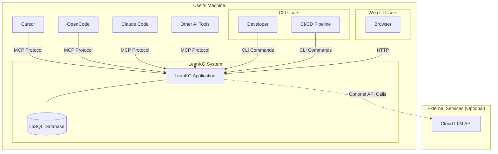
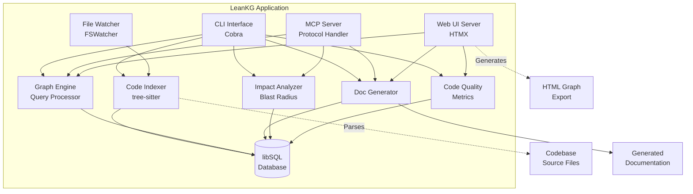
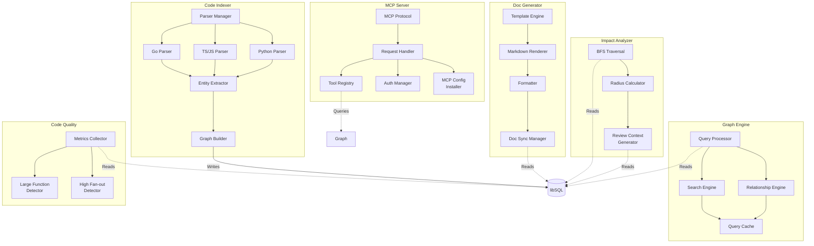
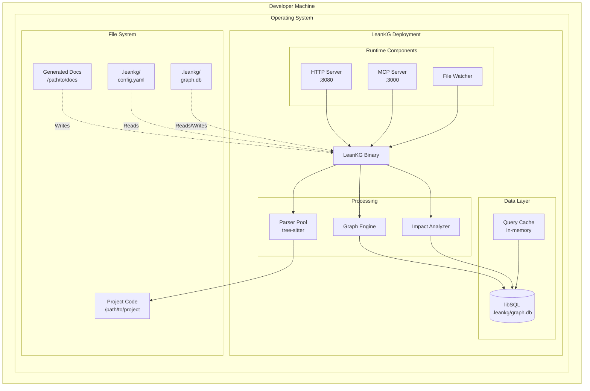
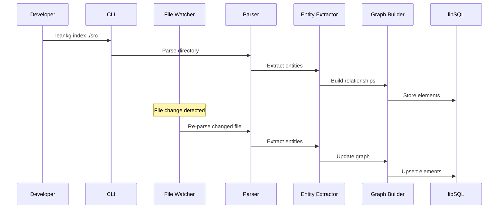
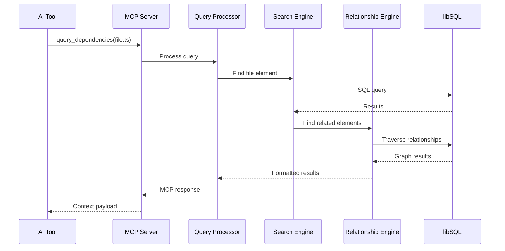
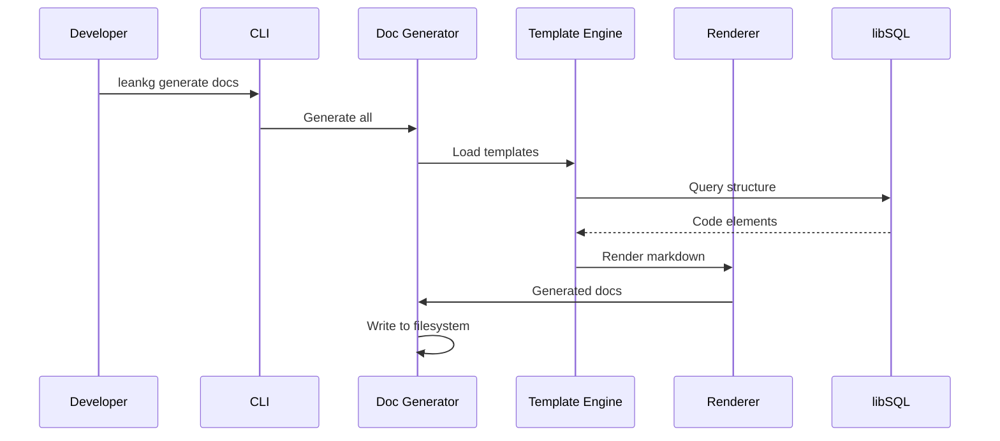
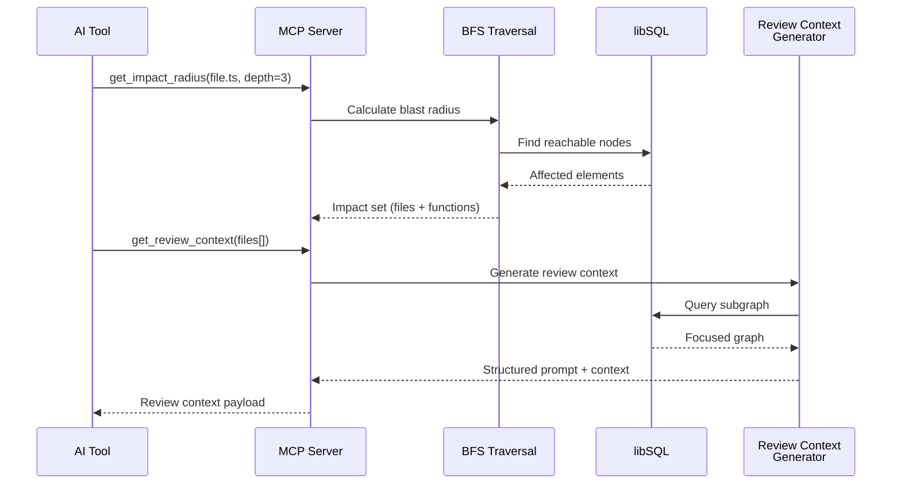
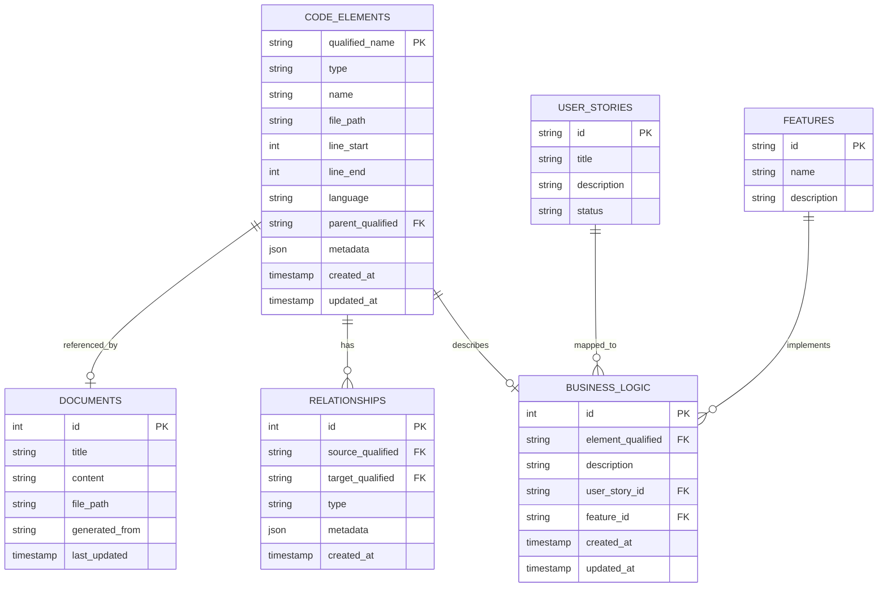

# LeanKG High Level Design

**Phiên bản:** 1.2  
**Ngày:** 2026-03-23  
**Dựa trên:** PRD v1.1  
**Trạng thái:** Bản nháp  
**Changelog:** 
- v1.2 - Tech stack: Rust + KuzuDB (recommended), Go + libSQL (alternative)
- v1.1 - Added impact radius analysis, TESTED_BY edges, review context, qualified names, auto-install MCP, per-project DB

---

## 1. Tổng quan kiến trúc

### 1.1 Design Principles

| Principle | Mô tả |
|-----------|-------|
| **Local-first** | Tất cả data và xử lý đều chạy local, không phụ thuộc cloud |
| **Single binary** | Ứng dụng được pack thành một file binary duy nhất |
| **Minimal dependencies** | Không yêu cầu external services như database processes |
| **Incremental** | Chỉ xử lý thay đổi, không scan lại toàn bộ |
| **MCP-native** | Thiết kế từ đầu cho MCP protocol |

### 1.2 System Overview

LeanKG là một local-first knowledge graph system cung cấp codebase intelligence cho AI coding tools. Hệ thống parse code, build dependency graph, và expose interface qua CLI và MCP server.

---

## 2. C4 Models

### 2.1 Context Diagram (C4-1)



**Mô tả:**
- **LeanKG System:** Hệ thống chính chạy trên máy người dùng
- **AI Tools:** Cursor, OpenCode, Claude Code và các AI coding tools khác tương tác qua MCP protocol
- **Developer:** Sử dụng CLI để index, query, và generate documentation
- **CI/CD Pipeline:** Tự động hóa indexing trong quá trình build
- **Browser:** Truy cập lightweight web UI
- **Cloud LLM API:** Optional - cho future semantic search features

### 2.2 Container Diagram (C4-2)



**Containers:**

| Container | Responsibility | Technology |
|-----------|---------------|------------|
| CLI Interface | Command-line interaction | Cobra (Go) |
| MCP Server | MCP protocol communication | Custom Go implementation |
| Web UI Server | HTTP server for UI | Go + HTMX |
| Code Indexer | Parse source code with tree-sitter | tree-sitter + Go |
| Graph Engine | Query and traverse knowledge graph | Go |
| Doc Generator | Generate markdown documentation | Go templates |
| File Watcher | Monitor file changes | fsnotify |
| Impact Analyzer | Calculate blast radius / impact radius | Go (BFS traversal) |
| Code Quality | Detect large functions, code metrics | Go |
| libSQL Database | Persistent storage (per-project) | libSQL (Turso) |

**Interactions:**

1. **CLI → Indexer:** Developer chạy lệnh index
2. **CLI → Graph:** Developer query knowledge graph
3. **CLI → DocGen:** Developer generate documentation
4. **CLI → Impact:** Developer calculate blast radius
5. **CLI → Qual:** Developer check code quality metrics
6. **MCP → Graph:** AI tools query code relationships
7. **MCP → DocGen:** AI tools retrieve context
8. **MCP → Impact:** AI tools calculate impact for changes
9. **Web → Graph:** User browse graph trong browser
10. **Web → Qual:** User view code quality metrics
11. **Indexer → DB:** Store parsed code elements
12. **Watcher → Indexer:** Trigger re-index khi files thay đổi
13. **Web → HTML:** Generate self-contained HTML graph export

### 2.3 Component Diagram (C4-3)



**Components:**

| Component | Responsibility |
|-----------|----------------|
| Parser Manager | Language detection và parser delegation |
| Go Parser | Parse Go source files |
| TS/JS Parser | Parse TypeScript/JavaScript files |
| Python Parser | Parse Python files |
| Entity Extractor | Extract functions, classes, imports, TESTED_BY |
| Graph Builder | Build relationships và store to DB |
| Query Processor | Process user queries |
| Search Engine | Search code elements |
| Relationship Engine | Traverse graph relationships |
| Query Cache | Cache frequent queries |
| BFS Traversal | Breadth-first search for blast radius |
| Radius Calculator | Calculate impact radius in N hops |
| Review Context Generator | Generate focused subgraph + prompt |
| Metrics Collector | Collect code quality metrics |
| Large Function Detector | Find oversized functions |
| High Fan-out Detector | Find functions with many dependencies |
| Template Engine | Load documentation templates |
| Markdown Renderer | Render markdown output |
| Formatter | Format documentation |
| Doc Sync Manager | Sync docs với code changes |
| MCP Protocol | Handle MCP protocol messages |
| Request Handler | Route requests to appropriate tools |
| Tool Registry | Register available MCP tools |
| Auth Manager | Authenticate MCP connections |
| MCP Config Installer | Auto-generate .mcp.json for AI tools |

### 2.4 Deployment Diagram (C4-4)



**Deployment Scenarios:**

| Scenario | Environment | Resources |
|----------|--------------|------------|
| macOS Intel | macOS x64 | < 100MB RAM, < 200MB disk |
| macOS Apple Silicon | macOS ARM64 | < 100MB RAM, < 200MB disk |
| Linux x64 | Linux x64 | < 100MB RAM, < 200MB disk |
| Linux ARM64 | Linux ARM64 | < 100MB RAM, < 200MB disk |

**Database Location:** Per-project at `.leankg/graph.db` (gitignored, portable with project)

**Processes:**

| Process | Port | Description |
|---------|------|-------------|
| LeanKG Binary | - | Main application process |
| HTTP Server | 8080 | Web UI server (optional) |
| MCP Server | 3000 | MCP protocol endpoint |
| File Watcher | - | Background fsnotify process |
| libSQL | - | Embedded in-process database |

---

## 3. Data Flow

### 3.1 Indexing Flow



### 3.2 Query Flow



### 3.3 Documentation Generation Flow



### 3.4 Impact Analysis Flow



---

## 4. Data Model

### 4.1 Entity Relationship Diagram



### 4.2 Schema Description

| Table | Mô tả |
|-------|-------|
| CODE_ELEMENTS | Lưu trữ tất cả code elements (files, functions, classes, imports, exports). PK = qualified_name (`file_path::parent::name`) |
| RELATIONSHIPS | Quan hệ giữa các elements (imports, calls, implements, contains, tested_by) |
| BUSINESS_LOGIC | Annotations mô tả business logic của từng element |
| DOCUMENTS | Generated documentation files |
| USER_STORIES | User stories được map với code |
| FEATURES | Features được map với code |

---

## 5. Interface Specifications

### 5.1 CLI Commands

| Command | Description |
|---------|-------------|
| `leankg init` | Initialize new LeanKG project in .leankg/ |
| `leankg index [path]` | Index codebase |
| `leankg query <query>` | Query knowledge graph |
| `leankg generate docs` | Generate documentation |
| `leankg annotate` | Add business logic annotations |
| `leankg serve` | Start MCP server và/hoặc web UI |
| `leankg status` | Show index status |
| `leankg watch` | Start file watcher |
| `leankg impact <file> [depth]` | Calculate blast radius for file |
| `leankg install` | Auto-generate MCP config for AI tools |
| `leankg export` | Export graph as self-contained HTML |
| `leankg quality` | Show code quality metrics (large functions) |

### 5.2 MCP Tools

| Tool | Description |
|------|-------------|
| `query_file` | Find file by name or pattern |
| `get_dependencies` | Get file dependencies (direct imports) |
| `get_dependents` | Get files depending on target |
| `get_impact_radius` | Get all files affected by change within N hops |
| `get_review_context` | Generate focused subgraph + structured review prompt |
| `find_function` | Locate function definition |
| `get_call_graph` | Get function call chain (full depth) |
| `search_code` | Search code elements by name/type |
| `get_context` | Get AI context for file (minimal, token-optimized) |
| `generate_doc` | Generate documentation for file |
| `find_large_functions` | Find oversized functions by line count |
| `get_tested_by` | Get test coverage for a function/file |

### 5.3 Web UI Routes

| Route | Description |
|-------|-------------|
| `/` | Main dashboard |
| `/graph` | Interactive graph visualization |
| `/browse` | Code browser |
| `/docs` | Documentation viewer |
| `/annotate` | Business logic annotation |
| `/quality` | Code quality metrics |
| `/export` | Generate self-contained HTML graph |
| `/settings` | Configuration |

---

## 6. Security Considerations

### 6.1 Local Security

| Concern | Mitigation |
|---------|------------|
| Data at rest | Database file stored locally with optional encryption |
| MCP authentication | Local token-based authentication |
| File access | Sandboxed to project directory |

### 6.2 Network Security

| Concern | Mitigation |
|---------|------------|
| HTTP exposure | Bind to localhost only by default |
| MCP exposure | Local socket or localhost binding |
| External APIs | Optional, user-controlled |

---

## 7. Performance Targets

| Operation | Target | Notes |
|-----------|--------|-------|
| Cold start | < 2s | Binary initialization |
| Index speed | > 10K LOC/s | Per language parser |
| Query latency | < 100ms | Graph queries |
| Memory idle | < 100MB | No active operations |
| Memory peak | < 500MB | During indexing |
| Disk footprint | < 50MB/100K LOC | Database size |

---

## 8. Configuration

### 8.1 Project Configuration (leankg.yaml)

```yaml
project:
  name: my-project
  root: ./src
  languages:
    - go
    - typescript
    - python

indexer:
  exclude:
    - "**/node_modules/**"
    - "**/vendor/**"
    - "**/*.test.go"
  include:
    - "*.go"
    - "*.ts"
    - "*.py"

mcp:
  enabled: true
  port: 3000
  auth_token: generated

web:
  enabled: true
  port: 8080

documentation:
  output: ./docs
  templates:
    - agents
    - claude
```

---

## 9. Error Handling

### 9.1 Error Categories

| Category | Handling | User Feedback |
|----------|----------|---------------|
| Parse errors | Skip file, log warning | Warning in CLI output |
| Database errors | Retry with backoff | Error message |
| MCP errors | Return error response | MCP error payload |
| File system errors | Graceful degradation | Warning |

### 9.2 Logging

- **Level:** Configurable (debug, info, warn, error)
- **Output:** STDERR by default, file option available
- **Format:** Structured JSON for machine parsing, text for human

---

## 10. Future Considerations

### 10.1 Phase 2 Features

- Web UI improvements
- Business logic annotations
- Additional language support (Rust, Java, C#)
- Incremental indexing optimization

### 10.2 Phase 3 Features

- Vector embeddings cho semantic search
- Cloud sync option
- Team features (shared knowledge graphs)
- Plugin system

---

## 11. Dependencies

### 11.1 Direct Dependencies (Rust + KuzuDB)

| Dependency | Version | Purpose |
|------------|---------|---------|
| kuzu | latest | Embedded graph database |
| tree-sitter | latest | Code parsing |
| clap | latest | CLI framework |
| notify | latest | File watching |
| axum | latest | Web server |
| mcp-protocol | latest | MCP server implementation |

### 11.2 Build Dependencies

| Dependency | Version | Purpose |
|------------|---------|---------|
| Rust | 1.75+ | Build toolchain |
| tree-sitter parsers | bundled | Language support (Go, TS, Python, Rust, etc.) |

### 11.3 Alternative Stack (Go + libSQL)

If using Go instead of Rust:

| Dependency | Version | Purpose |
|------------|---------|---------|
| libSQL / turso | latest | Embedded SQLite-compatible DB |
| tree-sitter-go | latest | Code parsing |
| Cobra | latest | CLI framework |
| fsnotify | latest | File watching |

---

## 12. Appendix

### 12.1 Glossary

| Term | Definition |
|------|------------|
| Container | Executable process in C4 model |
| Component | Internal module của container |
| Code element | File, function, class, import trong codebase |
| Context | Information provided to AI tool |
| Blast radius | Files affected by a change |
| Impact radius | Same as blast radius - BFS traversal within N hops |
| Qualified name | Natural node identifier: `file_path::parent::name` |
| TESTED_BY | Relationship type: test file tests production code |

### 12.2 References

- C4 Model: https://c4model.com/
- KuzuDB: https://github.com/kuzudb/kuzu (Embedded graph database)
- tree-sitter: https://tree-sitter.github.io/tree-sitter/
- MCP Protocol: https://modelcontextprotocol.io/
- code-review-graph: https://github.com/tirth8205/code-review-graph (inspiration for impact analysis)
